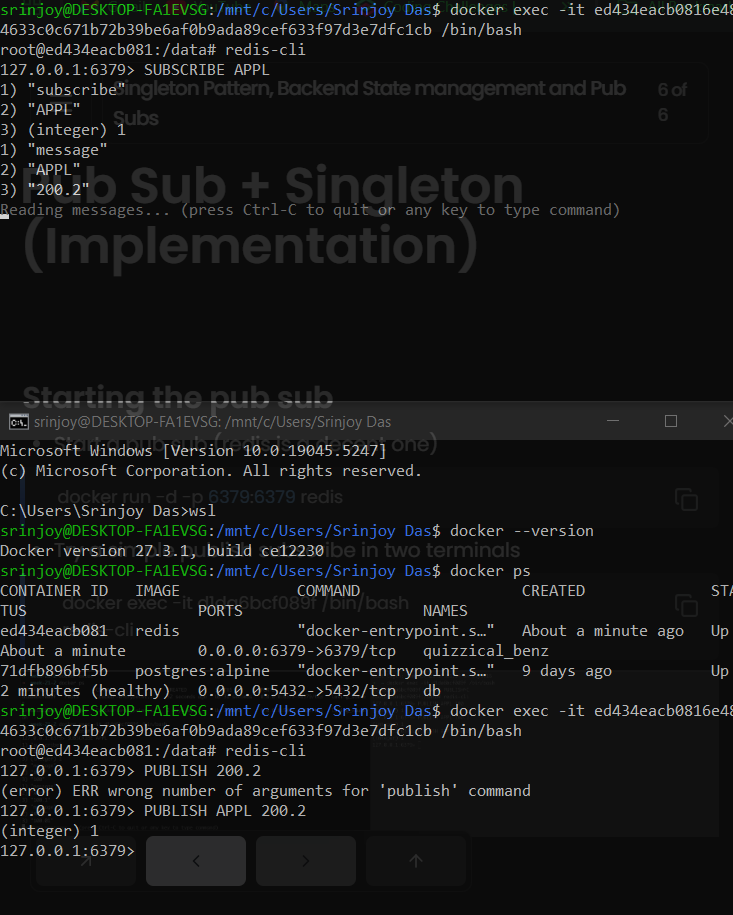
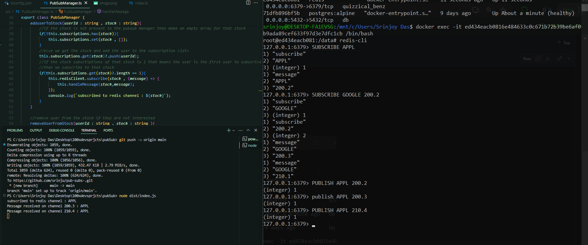

--suppose a user is connected to a ws server and wants apple stock price
--and anothe user on another ws server wants the same thing 
--then we can either send two http requests to the users
--but what we do is we make the user subscribe to the apple stock in the pubsub
--and the ws server will publish the apple stock price in the pubsub
--and whoevever clients are interested in the apple stock will get the data

-- from the below picture we can see that in terminal of a pub sub we can just make one client subscribe to the AAPL
-- and from the server we published the stock price as 200.2 and it came into the client

